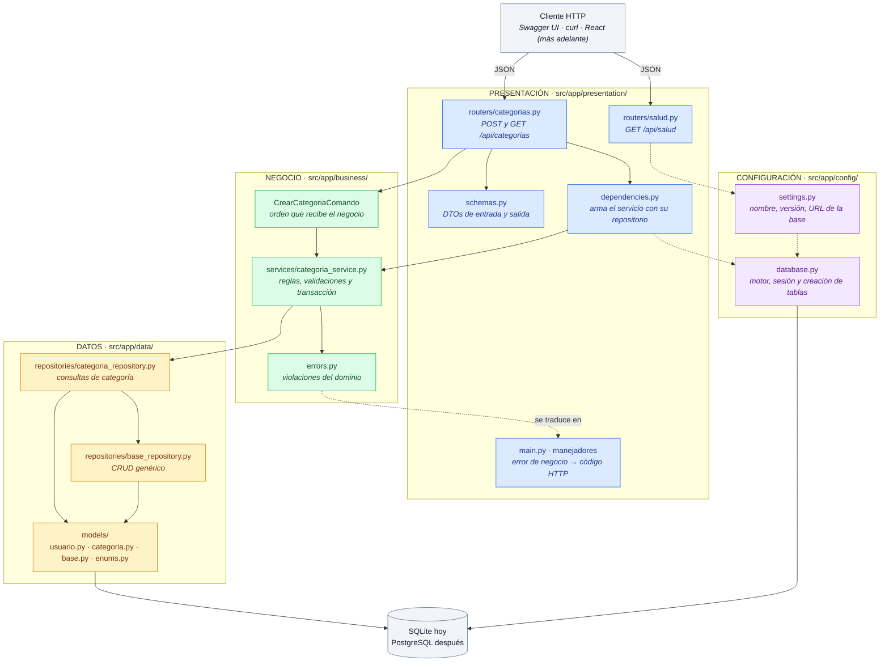
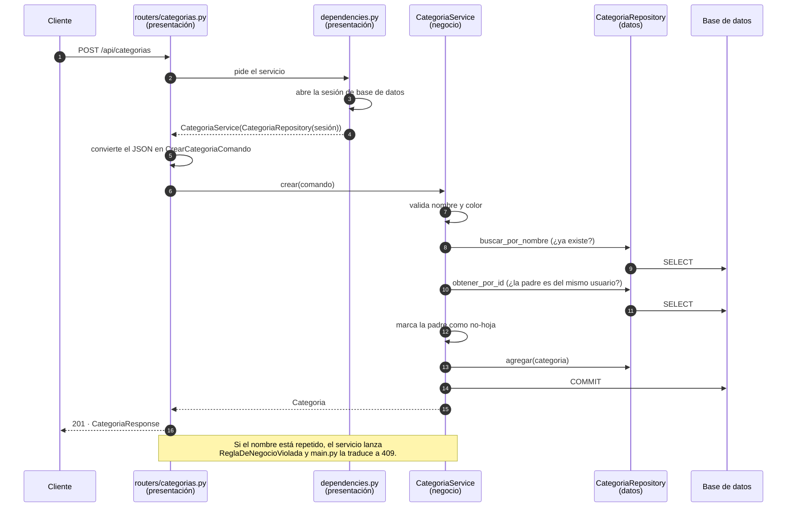
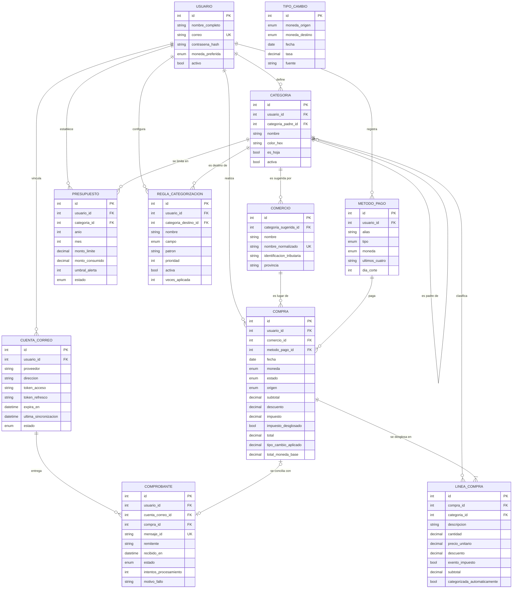
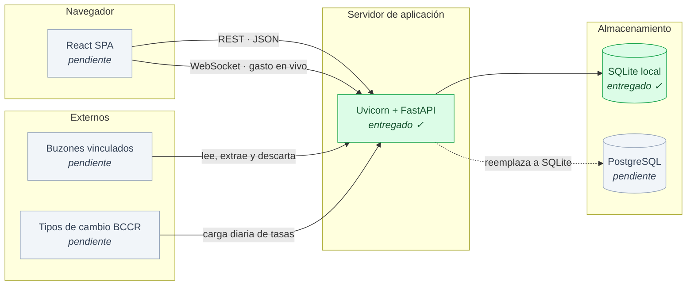

# Arquitectura · Gastonomo

**Laboratorio 1 · EIF509 · II Ciclo 2026**

---

## 1 · Capas y su interacción

Este diagrama refleja **los archivos entregados** para el Laboratorio 1. Se sigue la regla de: **presentación → negocio → datos, nunca al revés**. Cada capa conoce únicamente a la
que tiene debajo.

### Qué hace cada capa

| Capa | Carpeta | Responsabilidad | Lo que tiene prohibido |
|---|---|---|---|
| **Presentación** | `presentation/` | Traducir JSON a comandos, llamar al servicio, traducir el resultado y convertir errores de negocio en códigos HTTP. | Calcular, validar reglas o consultar la base. |
| **Negocio** | `business/` | Reglas del dominio y validaciones. Es el dueño de la transacción: decide cuándo confirmar. | Saber que existe HTTP o escribir SQL. |
| **Datos** | `data/` | Entidades y consultas. Es el único lugar que sabe cómo se leen y guardan los datos. | Contener reglas de negocio o confirmar transacciones. |
| **Configuración** | `config/` | Valores que cambian entre máquinas y el motor de conexión. | Contener lógica del dominio. |

### Cómo se sostiene la regla en Python

Python no impide que un router importe un repositorio, así que la separación se mantiene con tres
decisiones explícitas del código:

1. **El servicio recibe una dataclass propia** (`CrearCategoriaComando`), no un modelo de Pydantic.
   Si recibiera modelos de FastAPI, el negocio quedaría amarrado a la forma de la API y no se
   podría reutilizar desde un script o una tarea programada.
2. **El repositorio nunca confirma.** Solo agrega y consulta; el `commit` lo hace el servicio, que
   es el único que sabe si la operación de negocio completa terminó bien. Ese límite es el que más
   adelante sostiene el proceso de conciliación, que escribe en cinco tablas.
3. **Los errores de negocio son excepciones propias** (`business/errors.py`), sin ninguna
   referencia a HTTP. `main.py` es el único archivo autorizado a mapearlos a códigos de respuesta.

---

## 2 · Recorrido de una petición

Ejemplo real y verificable hoy: crear una categoría colgada de otra.

---

## 3 · Modelo de dominio

Las **once entidades** de la propuesta y sus relaciones. Este es el modelo objetivo del curso
completo, no el del código entregado: en el Laboratorio 1 solo están implementadas `USUARIO` y
`CATEGORIA` (marcadas en la tabla de abajo). La justificación de cada entidad está en
[`docs/propuesta-dominio.md`](propuesta-dominio.md).

| Entidad | Laboratorio |
|---|---|
| `USUARIO`, `CATEGORIA` | **Implementadas en el Laboratorio 1** |
| Las nueve restantes | Pendientes para los laboratorios siguientes |

Dos notas de modelado que valen la pena:

> **`TIPO_CAMBIO` aparece suelto a propósito.** No tiene llave foránea hacia `COMPRA`: la compra
> guarda copiada la tasa que se le aplicó (`tipo_cambio_aplicado`), no una referencia. Si apuntara
> a la fila, corregir una tasa mal cargada cambiaría retroactivamente los totales de compras ya
> cerradas. Copiar el valor congela el histórico.

> **`COMERCIO` apunta a `CATEGORIA`, no al revés.** Es la categoría *sugerida* del comercio, la
> pieza que hace posible la clasificación automática: como el comprobante que llega por correo
> solo trae el nombre del negocio, el comercio es la única señal disponible para adivinar la
> categoría.

---

## 4 · Despliegue previsto

> **Una sola base de datos.** El sistema no almacena los comprobantes: lee cada correo, le extrae
> los cuatro campos que necesita y descarta el contenido. Todo lo que se persiste tiene esquema
> fijo, así que PostgreSQL lo cubre entero y no hace falta una base documental.

En el Laboratorio 1 solo están construidas las cajas verdes: la aplicación FastAPI levantando,
respondiendo y guardando contra SQLite, con el esqueleto por capas listo para que las demás piezas
se conecten encima.
