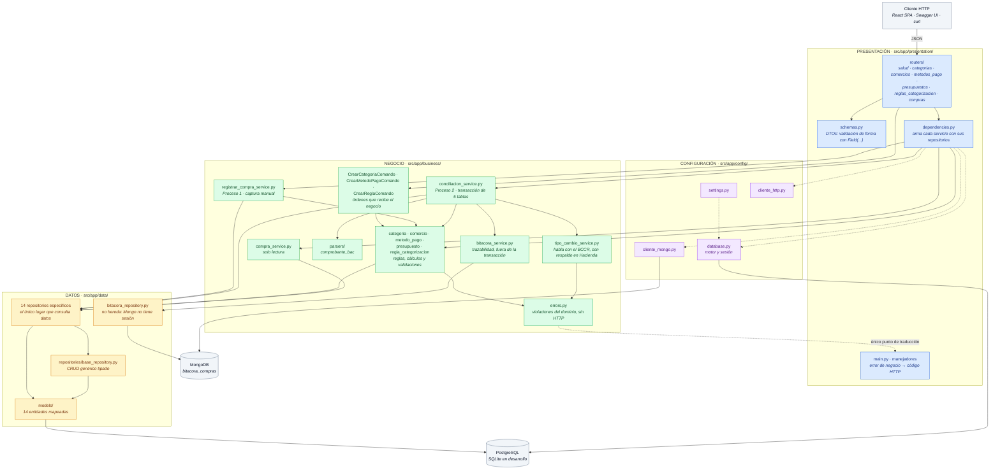
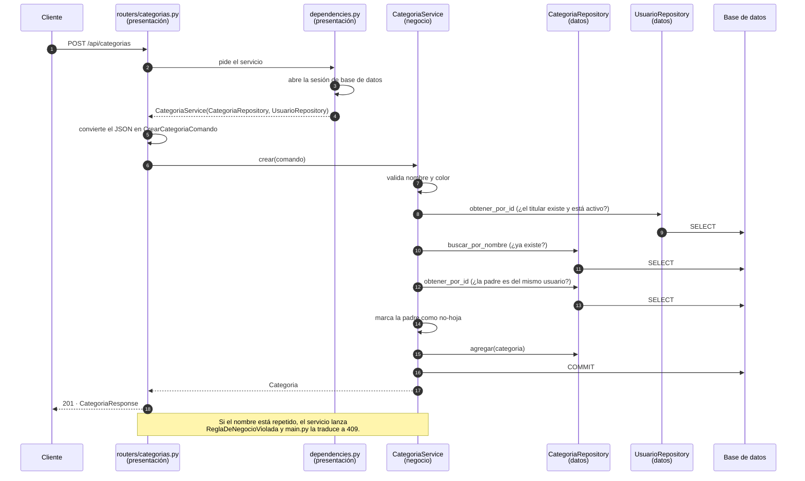
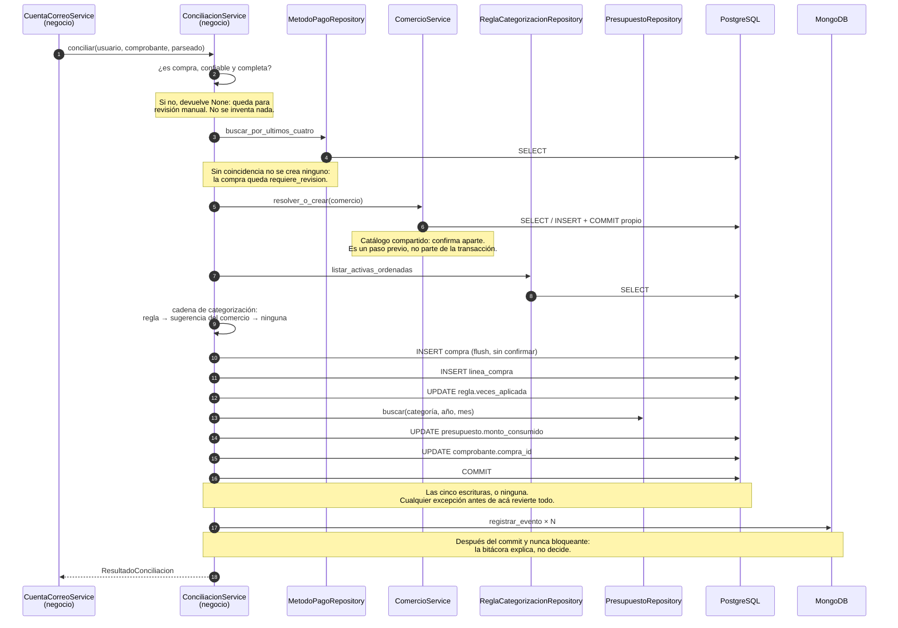
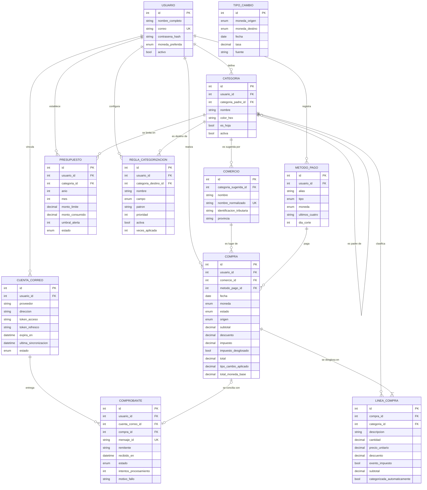
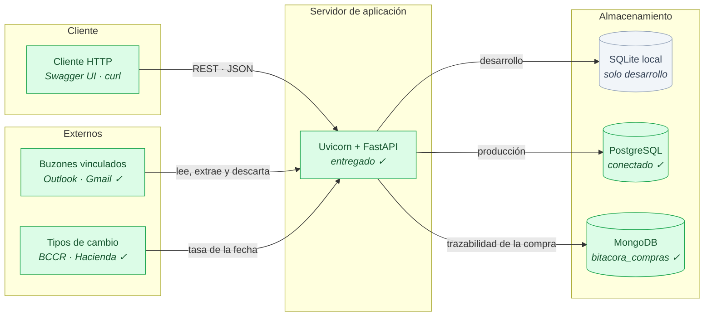

# Arquitectura · Gastonomo

**EIF509 · II Ciclo 2026 · actualizado en el Laboratorio 4**

> Este documento se actualiza en cada entrega. Las secciones § 1 y § 2 reflejan el código de hoy;
> la § 3 conserva el modelo de dominio del Laboratorio 1 con las notas de lo que cambió después, y
> la § 4 el despliegue.

---

## 1 · Capas y su interacción

Se sigue la regla de **presentación → negocio → datos, nunca al revés**. Cada capa conoce
únicamente a la que tiene debajo.

### Qué hace cada capa

| Capa | Carpeta | Responsabilidad | Lo que tiene prohibido |
|---|---|---|---|
| **Presentación** | `presentation/` | Traducir JSON a comandos, llamar al servicio, traducir el resultado y convertir errores de negocio en códigos HTTP. | Calcular, validar reglas o consultar la base. |
| **Negocio** | `business/` | Reglas del dominio y validaciones. Es el dueño de la transacción: decide cuándo confirmar. | Saber que existe HTTP o escribir SQL. |
| **Datos** | `data/` | Entidades y consultas. Es el único lugar que sabe cómo se leen y guardan los datos. | Contener reglas de negocio o confirmar transacciones. |
| **Configuración** | `config/` | Valores que cambian entre máquinas y el motor de conexión. | Contener lógica del dominio. |

### Cómo se sostiene la regla en Python

Python no impide que un router importe un repositorio, así que la separación se mantiene con tres
decisiones explícitas del código:

1. **El servicio recibe una dataclass propia** (`CrearCategoriaComando`), no un modelo de Pydantic.
   Si recibiera modelos de FastAPI, el negocio quedaría amarrado a la forma de la API y no se
   podría reutilizar desde un script o una tarea programada.
2. **El repositorio nunca confirma.** Solo agrega y consulta; el `commit` lo hace el servicio, que
   es el único que sabe si la operación de negocio completa terminó bien. Ese límite es el que
   sostiene el proceso de conciliación, que escribe en cinco tablas -ver § 2.2.
3. **Los errores de negocio son excepciones propias** (`business/errors.py`), sin ninguna
   referencia a HTTP. `main.py` es el único archivo autorizado a mapearlos a códigos de respuesta.

Las reglas de cada proceso, los patrones de diseño aplicados y lo que queda abierto están en el
documento de la [Capa de negocio](negocio.md).

---

## 2 · Recorrido de una petición

### 2.1 · Un caso simple: crear una categoría colgada de otra

### 2.2 · El caso transaccional: conciliar un comprobante

El Proceso 2 del dominio. Escribe en **cinco tablas** y todas tienen que ocurrir o ninguna: el
único `commit` está al final, y ningún repositorio confirma por su cuenta. Las reglas completas
están en [Capa de negocio § 2.1](negocio.md#21--proceso-2--ingesta-y-conciliación-de-un-comprobante-transaccional).

---

## 3 · Modelo de dominio

Las **once entidades** de la propuesta y sus relaciones, tal como se dibujaron en el Laboratorio 1.
Se conserva el diagrama original y la tabla de abajo dice en qué entrega se implementó cada parte;
el modelo real de hoy tiene 14 entidades y está en el
[Modelo de datos § 2.1](modelo-de-datos.md). La justificación de cada entidad está en la
[Propuesta de dominio](propuesta-dominio.md).

| Entidad | Laboratorio |
|---|---|
| `USUARIO`, `CATEGORIA` | Implementadas como clases en el Laboratorio 1 |
| Las once tablas del esquema, más `CATEGORIA_ESTANDAR` | **Creadas en PostgreSQL en el Laboratorio 2** |
| Las 14 entidades, con sus relaciones y su carga diferida razonada | **Mapeadas con SQLAlchemy en el Laboratorio 3** |
| `COMPRA`, `LINEA_COMPRA`, `PRESUPUESTO`, `REGLA_CATEGORIZACION`, `COMPROBANTE` | **Escritas dentro de una sola transacción en el Laboratorio 4** |

> **Actualizado en el Laboratorio 2.** El diagrama de arriba es el del Laboratorio 1. El modelo
> implementado de verdad agrega una entidad —`CATEGORIA_ESTANDAR`, la taxonomía global que siembra
> cada cuenta y a la que apuntan los comercios compartidos— y está en el
> [Modelo de datos § 2.1](modelo-de-datos.md), con la explicación del ajuste en la § 5.1.

Dos notas de modelado que valen la pena:

> **`TIPO_CAMBIO` aparece suelto a propósito.** No tiene llave foránea hacia `COMPRA`: la compra
> guarda copiada la tasa que se le aplicó (`tipo_cambio_aplicado`), no una referencia. Si apuntara
> a la fila, corregir una tasa mal cargada cambiaría retroactivamente los totales de compras ya
> cerradas. Copiar el valor congela el histórico.

> **`COMERCIO` apunta a `CATEGORIA`, no al revés.** Es la categoría *sugerida* del comercio, la
> pieza que hace posible la clasificación automática: como el comprobante que llega por correo
> solo trae el nombre del negocio, el comercio es la única señal disponible para adivinar la
> categoría.

---

## 4 · Despliegue

> **Una sola base de datos.** El sistema no almacena los comprobantes: lee cada correo, le extrae
> los cuatro campos que necesita y descarta el contenido. Todo lo que se persiste tiene esquema
> fijo, así que PostgreSQL lo cubre entero y no hace falta una base documental.
>
> **Revisado en el Laboratorio 2.** El sistema pasó a **persistencia políglota**: el núcleo sigue
> completo en PostgreSQL —esa parte no cambió— y se sumó MongoDB con una sola colección,
> `bitacora_compras`, que guarda la trazabilidad de cada compra. Los comprobantes siguen sin
> almacenarse. Ver [ADR-002](adr/ADR-002-subdominio-documental-en-mongodb.md) y el
> [Modelo de datos](modelo-de-datos.md).

`docker compose up -d` levanta PostgreSQL, el contenedor de Flyway que aplica las migraciones y
los datos de ejemplo, y MongoDB con su colección ya validada. La aplicación corre aparte y se
conecta a las dos: `GASTONOMO_URL_BASE_DATOS` apunta el ORM a PostgreSQL en lugar de SQLite, y
`BitacoraComprasService` escribe la trazabilidad en MongoDB desde la conciliación real.

> **Una salvedad de esquema.** La aplicación en ejecución crea sus tablas con
> `Base.metadata.create_all()`, no con Flyway. Las migraciones de
> [`db/postgres/migrations/`](../db/postgres/migrations/) son la fuente de verdad documentada del
> modelo, pero todavía no son la que la aplicación aplica al arrancar. Está declarado como
> pendiente en [Capa de negocio § 8](negocio.md#8--lo-que-queda-abierto).
