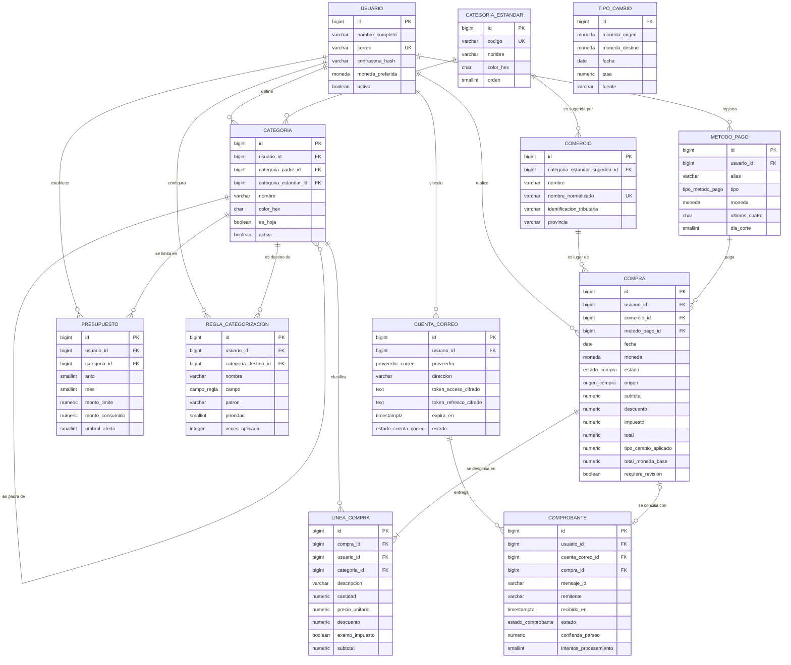

# Modelo de datos · Gastonomo

**Laboratorio 2 · EIF509 Desarrollo de Aplicaciones Basadas en Web · II Ciclo 2026 · Grupo G01**

Jose Alexis Solís Carvajal · 1-1623-0238
Luis Antonio Montes de Oca Ruiz · 1-1800-0270

---

## 1 · Qué vive en cada base

Gastonomo usa **persistencia políglota**: dos bases, cada una para lo que hace mejor.

| | PostgreSQL | MongoDB |
|---|---|---|
| **Qué guarda** | Las doce tablas del núcleo: titulares, categorías, comercios, métodos de pago, compras, renglones, comprobantes, presupuestos, reglas y tipos de cambio. | Una colección: `bitacora_compras`, la trazabilidad de cómo cada compra llegó a ser lo que es. |
| **Por qué** | Todo está relacionado con todo, los totales tienen que cuadrar, la conciliación escribe en cinco tablas a la vez y las reglas de integridad son estrictas. | Los eventos de una compra se leen siempre juntos, crecen poco, nadie más los necesita y **cada tipo de evento tiene campos distintos**. |
| **Volumen** | 12 tablas · 17 llaves foráneas · 17 restricciones `UNIQUE` · 42 `CHECK` · 46 índices | 1 colección · validador de esquema · 4 índices |

La regla que separa las dos: **cada dato tiene un dueño**. El dueño de una compra es
PostgreSQL. MongoDB guarda referencias numéricas (`compra_id`, `categoria_id`, `regla_id`) hacia
allá, nunca copias del dato.

---

## 2 · El modelo relacional

### 2.1 · Diagrama



`TIPO_CAMBIO` aparece **suelto a propósito**: no hay llave foránea desde `COMPRA`. La compra guarda
copiada la tasa que se le aplicó, no una referencia. Si apuntara a la fila, corregir una tasa mal
cargada cambiaría retroactivamente los totales de compras ya cerradas.

### 2.2 · Normalización

El esquema está en **tercera forma normal**: cada tabla tiene una llave primaria simple, no hay
grupos repetidos, ningún atributo depende de parte de una llave (no hay llaves compuestas como
primarias) y ningún atributo no clave depende de otro atributo no clave.

Hay **cinco excepciones deliberadas**. Todas se hicieron por una razón concreta y todas se mantienen
dentro de la misma transacción que las produce, que es lo que impide que se desincronicen:

| Dónde | Qué se repite o deriva | Por qué se aceptó |
|---|---|---|
| `compra.subtotal`, `impuesto`, `total`, `total_moneda_base` | Se pueden calcular sumando los renglones. | **No son un cálculo, son un hecho histórico.** Un gasto de marzo debe seguir mostrando lo que se pagó aunque en junio cambie el IVA o se corrija la tasa del día. Además los tres `CHECK` de la V3 obligan a que cuadren con la fórmula. |
| `presupuesto.monto_consumido` | Es la suma de las compras del mes en esa categoría. | El frontend lo muestra **en vivo**. Recalcular la suma de todas las compras del mes en cada refresco de pantalla no escala. |
| `categoria.es_hoja` | Se deduce de si tiene hijas. | La pantalla de captura lo consulta **en cada renglón** para saber qué categorías puede ofrecer. Deducirlo obligaría a un `EXISTS` por opción del selector. |
| `comercio.nombre_normalizado` | Se deriva de `nombre`. | Es la **llave de agrupación** de la ingesta y el campo sobre el que va el índice de trigramas. Derivarlo en cada consulta impediría indexarlo. |
| `linea_compra.usuario_id` | Se deduce vía `compra_id`. | Es la única que no existe por rendimiento: **existe para poder expresar una regla de negocio como restricción**. Ver el punto siguiente. |

### 2.3 · Restricciones: qué garantiza la base y qué no

La idea que guía el esquema es que **una regla de negocio verificable debe vivir en la base**, no
solo en el servicio: la base es la última línea, y la respetan por igual la aplicación, un script de
carga y alguien conectado con `psql`.

**Aislamiento entre cuentas, con llaves foráneas compuestas.** El sistema es multiusuario y la
propuesta de dominio marca como validación crítica que «toda categoría, comercio y método de pago
referenciado debe pertenecer al titular». Una `FOREIGN KEY (categoria_id) REFERENCES categoria(id)`
normal **no** dice eso: aceptaría el id de la categoría de otra persona. La solución es declarar
`UNIQUE (id, usuario_id)` en las tablas padre y referenciarlas por el par:

```sql
CONSTRAINT fk_linea_compra_categoria
    FOREIGN KEY (categoria_id, usuario_id)
    REFERENCES categoria (id, usuario_id)
```

Ese es el motivo de que `linea_compra` cargue con un `usuario_id` redundante. El mismo patrón cubre
`compra → metodo_pago`, `presupuesto → categoria`, `regla_categorizacion → categoria` y
`comprobante → cuenta_correo`. Con esto, pasar un id ajeno no es un error que el servicio *debería*
atrapar: es un dato que la base **no puede** almacenar.

**Reglas del dominio escritas como `CHECK`.** Algunas que valen la pena:

| Restricción | Regla que implementa |
|---|---|
| `ck_compra_total_cuadra` | `total = subtotal − descuento + impuesto`. El descuento global no se prorratea: se resta después de sumar. |
| `ck_compra_total_base_cuadra` | `total_moneda_base = round(total × tipo_cambio_aplicado, 2)`. |
| `ck_compra_moneda_base_sin_conversion` | Una compra en colones lleva tasa exactamente 1. |
| `ck_compra_ingesta_sin_desglose` | Una compra que entró por correo nunca desglosa impuesto: el total ya viene con IVA y no se sabe qué parte era exenta. |
| `ck_linea_subtotal_cuadra` | `subtotal = round(cantidad × precio_unitario − descuento, 2)`. |
| `ck_metodo_pago_ultimos_cuatro_solo_tarjeta` | Solo las tarjetas tienen últimos cuatro dígitos; el efectivo con un `0000` inventado ensuciaría el emparejamiento. |
| `ck_comprobante_fallo_con_motivo` | Un comprobante `FALLIDO` sin motivo no es diagnosticable. |

**Restricciones `UNIQUE` que no son cosméticas.** Tres sostienen procesos completos:

- `uq_comprobante_buzon_mensaje (cuenta_correo_id, mensaje_id)` — es **la idempotencia de la
  ingesta**. Si el buzón reentrega el mismo correo, el `INSERT` falla en vez de duplicar el gasto.
  Es por buzón y no global porque el identificador de mensaje solo es único dentro del proveedor.
- `uq_metodo_pago_usuario_ultimos_cuatro` (índice único parcial) — si el titular tuviera dos
  tarjetas terminadas en `6411`, el emparejamiento de la ingesta sería ambiguo y el gasto se
  cargaría a la tarjeta equivocada. El modelo prefiere **impedirlo** a resolverlo adivinando.
- `uq_regla_usuario_prioridad` — las reglas se evalúan por prioridad ascendente y gana la primera
  que coincide. Con prioridades repetidas, el resultado dependería del orden en que la base
  devolviera las filas: la misma compra podría caer en categorías distintas en dos corridas.

**Lo que el esquema NO puede garantizar**, y por eso queda en la capa de negocio:

| Regla | Por qué no cabe en una restricción |
|---|---|
| «La fecha de la compra no puede ser futura» | PostgreSQL exige que las funciones de un `CHECK` sean `IMMUTABLE`, y `CURRENT_DATE` es `STABLE`. |
| «Una compra `REGISTRADA` no admite renglones sin categoría» | Cruza dos tablas; un `CHECK` solo ve su propia fila. |
| «Solo se clasifica en categorías hoja» | Igual: exige mirar la fila de `categoria` desde `linea_compra`. |
| «Una categoría no puede ser ancestro de sí misma» (ciclos A→B→A) | `ck_categoria_padre_distinta` corta el ciclo de largo 1; los más largos requieren recorrer el árbol. |
| «Una compra `CONCILIADA` no se edita» | Es una transición de estado, no una propiedad de la fila. |

### 2.4 · Índices y la consulta que justifica cada uno

Los índices que nacen de una restricción ya quedan creados con su tabla. Los que existen **solo por
rendimiento** están agrupados en [`V5__indices_de_consulta.sql`](../db/postgres/migrations/V5__indices_de_consulta.sql),
precisamente porque se justifican contra una consulta, se miden y se pueden quitar sin cambiar el
significado del modelo. Un índice no es gratis: ocupa espacio y encarece cada `INSERT` y `UPDATE`.

| Índice | Consulta que lo justifica | Detalle |
|---|---|---|
| `ix_compra_usuario_fecha` | Lista de gastos del titular en un rango, ordenada por fecha descendente. | La pantalla principal. El orden `DESC` dentro del índice resuelve filtro y `ORDER BY` en un solo recorrido. |
| `ix_linea_compra_categoria` | Reporte de gasto por categoría. | `INCLUDE (subtotal)`: la suma se calcula leyendo solo el índice. Parcial: excluye los renglones sin clasificar. |
| `ix_compra_usuario_comercio` | Reporte de gasto por comercio. | Dos índices y no uno porque el criterio de agrupación es el que ordena las filas, y un índice solo tiene un orden. |
| `ix_compra_usuario_metodo_pago` | Reporte de gasto por método de pago. | Parcial: deja fuera las compras sin tarjeta emparejada. |
| `ix_comprobante_pendientes` | Cola de trabajo del servicio de ingesta. | **Parcial.** Los `PROCESADO` son casi toda la tabla y crecen sin parar, pero nunca aparecen en esta consulta. |
| `ix_compra_revision_pendiente` | Bandeja de revisión manual. | Parcial: lo normal es que una compra no requiera revisión. |
| `ix_categoria_usuario_activa` | Selector de categorías. | Parcial: una categoría con gasto no se borra, se desactiva, y las inactivas no se vuelven a mostrar. |
| `ix_regla_evaluacion` | Recorrido del motor de reglas por prioridad. | Parcial sobre `activa`: las desactivadas nunca se evalúan. |
| `ix_tipo_cambio_busqueda` | «La tasa USD→CRC más reciente que no pase de esta fecha». | Orden `DESC` por fecha: la fila buscada queda primera. |
| `ix_comercio_nombre_trigramas` | Resolución difusa del comercio: `AUTOMERCADO #12 SAN PEDRO` contra `AUTOMERCADO`. | GIN con `pg_trgm`. Sin él, cada correo que entra compara contra todo el catálogo. |

### 2.5 · Un detalle de precisión que el modelo obliga a respetar

Todo monto es `NUMERIC`, nunca punto flotante: con `float`, `0.1 + 0.2` no da `0.3` y un reporte de
gastos que no cuadra por céntimos no sirve.

Además, el **orden del redondeo importa**. La regla del dominio es que el presupuesto se acumula con
el total de cada compra ya convertido y redondeado. Un reporte que en cambio redondee al final da un
resultado distinto:

```
sum(round(subtotal × tasa, 2))  = 6144.64 + 8219.66 = 14 364.30   ← lo que dice el presupuesto
round(sum(subtotal × tasa), 2)  = round(14 364.2947) = 14 364.29   ← un céntimo de diferencia
```

No es un error de la base: es que redondear por compra y redondear al final son dos operaciones
distintas. Los reportes deben sumar montos **ya redondeados**, que es como se acumuló el consumo.

---

## 3 · El subdominio en MongoDB

### 3.1 · Qué es

La colección **`bitacora_compras`**: un documento por compra, con la lista de eventos que explican
cómo esa compra llegó a ser lo que es. De qué correo nació, con cuánta confianza se parseó, con qué
tarjeta se emparejó, qué regla le puso la categoría, qué corrigió el titular, con qué tasa se
convirtió y a qué presupuesto impactó.

No es un adorno: es el **diferenciador declarado del sistema**. La propuesta de dominio dice que de
cualquier total en pantalla se puede bajar hasta el comprobante que lo generó, pasando por el tipo de
cambio y la regla que se aplicaron. Eso es exactamente lo que guarda esta colección.

### 3.2 · La justificación, en las tres preguntas de diseño

> Elegimos implementar en MongoDB el subdominio de **trazabilidad de la compra**, porque:
>
> **(1) Estos datos se leen siempre juntos y completos**, por unidad de compra. La consulta del 90 %
> es una sola: el titular abre un gasto y pregunta «¿por qué esto quedó en esta categoría?». Se trae
> la bitácora entera de esa compra y se pinta como una línea de tiempo. Nunca se consultan eventos
> sueltos cruzando compras, ni se hace un *join* entre bitácoras. → **incrustar**.
>
> **(2) Su crecimiento en el peor caso está acotado.** Una compra acumula entre 4 y 10 eventos; una
> muy manoseada —partida en renglones y recategorizada varias veces— llegaría a 30. En los datos de
> ejemplo, los documentos miden **entre 1 733 y 2 841 bytes con 6 a 8 eventos**, es decir unos 350
> bytes por evento. Aun con 200 eventos serían ~70 KB, el 0,4 % del límite de 16 MB por documento. La
> lista no crece sin límite porque **está atada a un objeto que termina**: una compra se concilia y
> deja de generar eventos. → **incrustar**.
>
> **(3) Nadie más los necesita.** Los eventos solo los consulta su propia compra y su titular. Ningún
> reporte del sistema agrega eventos entre compras: los reportes suman montos, y los montos viven en
> PostgreSQL. → **incrustar**.
>
> El núcleo transaccional del sistema (titulares, categorías, comercios, compras, renglones,
> comprobantes, presupuestos y tipos de cambio) permanece en PostgreSQL porque exige integridad
> referencial entre nueve entidades, transacciones que escriben en cinco tablas a la vez y reglas de
> negocio verificables en el esquema.

**Y una cuarta razón, de forma.** Cada tipo de evento lleva **campos distintos**:

| Tipo de evento | Qué guarda en `datos` |
|---|---|
| `PARSEO_COMPROBANTE` | confianza, patrón del remitente, campos extraídos, campos faltantes |
| `EMPAREJAMIENTO_METODO_PAGO` | últimos cuatro dígitos, resultado, id del método |
| `RESOLUCION_COMERCIO` | nombre crudo, nombre normalizado, estrategia, similitud, si se creó |
| `CATEGORIZACION_AUTOMATICA` | origen (regla o comercio), id de la regla, patrón, reglas evaluadas |
| `CORRECCION_MANUAL` | categoría anterior y nueva, motivo, si se ofreció crear regla y si se aceptó |
| `CONVERSION_MONEDA` | monedas, tasa, fecha de la tasa, fuente, monto antes y después |
| `IMPACTO_PRESUPUESTO` | presupuesto, consumido antes y después, porcentaje, si disparó alerta |
| `ANULACION` | motivo, monto devuelto al presupuesto |

En PostgreSQL esto sería una tabla con quince columnas casi siempre nulas, o un EAV
(`evento_id, clave, valor`) que hay que reconstruir con pivotes en cada consulta. Ninguna de las dos
es un buen modelo. Aquí cada evento **define su propia forma** dentro del bloque `datos`, y eso es
justamente lo que un documento hace bien.

### 3.3 · Forma del documento

```javascript
{
  compra_id:      NumberLong(7),          // → compra.id en PostgreSQL
  usuario_id:     NumberLong(1),          // → usuario.id en PostgreSQL
  estado_actual:  "REGISTRADA",
  abierta_en:     ISODate("2026-08-19T01:33:02Z"),
  actualizada_en: ISODate("2026-08-19T14:22:40Z"),
  eventos: [
    {
      secuencia:   NumberInt(3),
      tipo:        "CATEGORIZACION_AUTOMATICA",
      ocurrido_en: ISODate("2026-08-19T01:33:04Z"),
      actor:       { tipo: "SISTEMA", nombre: "motor-de-reglas" },
      datos: {                             // ← la forma cambia según el tipo
        origen: "REGLA", regla_id: NumberLong(1),
        patron: "AUTOMERCADO", categoria_id: NumberLong(2)
      }
    },
    {
      secuencia:   NumberInt(5),
      tipo:        "CORRECCION_MANUAL",
      ocurrido_en: ISODate("2026-08-19T14:21:02Z"),
      actor:       { tipo: "TITULAR", usuario_id: NumberLong(1) },
      datos: {
        linea_id: NumberLong(10),
        categoria_anterior_id: NumberLong(2), categoria_nueva_id: NumberLong(8),
        regla_ofrecida: true, regla_aceptada: false,
        por_que_no: "Automercado seguira siendo Supermercado por defecto"
      }
    }
  ]
}
```

### 3.4 · Estructura sí, aunque sea MongoDB

«Elegir MongoDB porque es más fácil no diseñar el esquema» produce un desorden de datos. La
estructura se diseña igual; lo que cambia es que aquí la define el patrón de consulta.

La colección se crea con un **validador `$jsonSchema`** en `validationLevel: strict` y
`validationAction: error` —rechaza la escritura, no solo la anota—. Fija lo que todo evento debe
traer (`secuencia`, `tipo` de una lista cerrada de trece, `ocurrido_en`, `actor`) y deja libre
únicamente `datos`, que es lo que legítimamente varía. `additionalProperties: false` en el primer
nivel impide que se cuele un campo por error de tipeo.

También lleva `maxItems: 200` en el arreglo. **No es un límite del negocio**: es una alarma. Si una
bitácora llegara a 200 eventos, la premisa «crece poco» dejó de ser cierta y hay que revisar la
decisión de incrustar — mejor descubrirlo con un error que con un documento de 16 MB en producción.

El script [`db/pruebas/validador_mongo.js`](../db/pruebas/validador_mongo.js) comprueba que el
validador rechaza: un tipo de evento inventado, un evento sin actor, una bitácora vacía, un campo no
declarado, un estado de compra inválido y una segunda bitácora para la misma compra.

### 3.5 · Índices

| Índice | Consulta que lo justifica |
|---|---|
| `uq_bitacora_compra` (único, `compra_id`) | La consulta del 90 %. Es único porque dos documentos para la misma compra significarían que parte de la historia quedó invisible. |
| `ix_bitacora_usuario_reciente` (`usuario_id`, `actualizada_en` desc) | Pantalla de movimientos recientes del titular. |
| `ix_bitacora_usuario_tipo_evento` (`usuario_id`, `eventos.tipo`) | **Multiclave** sobre el arreglo incrustado: «¿cuántas compras tuvo que corregir a mano?», que es la métrica de si la clasificación automática está mejorando. |
| `ix_bitacora_regla_aplicada` (parcial, `eventos.datos.regla_id`) | «¿En qué compras acertó esta regla?». Parcial porque solo una minoría de eventos lleva `regla_id`. |

### 3.6 · Qué NO se guarda aquí

- **Ninguna copia del núcleo.** Los documentos referencian compras, categorías, reglas y
  presupuestos por su id de PostgreSQL. La única excepción declarada es `estado_actual`, replicado
  para poder filtrar bitácoras sin abrir una conexión a la otra base.
- **Las cifras que sí viven aquí no son copias, son el hecho registrado**: la tasa que se aplicó ese
  día, el consumo del presupuesto antes y después. Si mañana se corrige la tabla de tipos de cambio,
  el evento debe seguir diciendo con qué número se convirtió realmente.
- **El cuerpo del correo, jamás.** El sistema lee el mensaje, extrae los cuatro campos que necesita y
  lo descarta; en la bitácora solo queda el identificador del mensaje. Guardar correos bancarios
  significaría custodiar información financiera sensible que el sistema no necesita para funcionar.
  Lo que no se almacena no se puede filtrar.

### 3.7 · Cuándo esta decisión dejaría de ser correcta

Una decisión bien justificada dice también qué la invalidaría:

- Si apareciera un reporte que **agregue eventos entre compras** de forma constante («todos los
  eventos de corrección de todos los titulares del último mes, con su comercio y su categoría»),
  estaríamos forzando *joins* entre colecciones y el subdominio habría dejado de ser documental.
- Si los eventos dejaran de estar atados a una compra que termina —por ejemplo, si registráramos
  también cada vez que alguien *mira* un gasto— la lista pasaría a crecer sin límite y habría que
  **referenciar** en vez de incrustar, con un documento por evento.
- Si estos datos participaran en una transacción con el núcleo (que un evento y un saldo cuadren
  siempre), volverían a PostgreSQL. Hoy no participan: la bitácora **explica** lo que pasó, no lo
  decide.

---

## 4 · Cómo se levanta todo

Un solo comando, desde la raíz del repositorio:

```bash
docker compose up -d
```

Qué hace, en orden:

1. Arranca **PostgreSQL 17** y espera a que su *healthcheck* confirme que acepta conexiones. Sin esa
   espera, Flyway intentaría migrar contra una base todavía inicializándose y fallaría de forma
   intermitente.
2. **Flyway 11** aplica `V1` … `V5` y luego el callback de datos de ejemplo. Termina y se apaga: es
   una tarea, no un servicio. Verla como `Exited (0)` es el resultado correcto.
3. Arranca **MongoDB 8** y, la primera vez, ejecuta los scripts de `db/mongo/init`: crean la
   colección con su validador, sus índices y sus documentos de ejemplo.

Para volver a cero:

```bash
docker compose down -v
```

### Estructura de archivos

```
db/
├── postgres/
│   ├── migrations/                              → historial versionado del esquema
│   │   ├── V1__nucleo_identidad_y_clasificacion.sql
│   │   ├── V2__catalogos_de_apoyo.sql
│   │   ├── V3__nucleo_transaccional.sql
│   │   ├── V4__presupuestos_y_reglas.sql
│   │   └── V5__indices_de_consulta.sql
│   └── seeds/
│       └── afterMigrate__datos_de_ejemplo.sql   → callback, no migración
└── mongo/
    └── init/
        ├── 01_bitacora_compras.js               → colección, validador e índices
        └── 02_datos_de_ejemplo.js
```

### Por qué los seeds son un *callback* y no una `V6`

Los datos de ejemplo **no son parte del esquema**. Si vivieran como `V6`, Flyway los registraría en
su historial y llevar el esquema a producción obligaría a excluir una versión a mano. Como callback
`afterMigrate` corren con el mismo `docker compose up` en desarrollo, y se dejan fuera en cualquier
otro entorno quitando su carpeta de `flyway.locations`.

Como `afterMigrate` se ejecuta en **cada** `flyway migrate` —también cuando no hay nada nuevo que
aplicar—, todos los `INSERT` llevan `ON CONFLICT DO NOTHING` y al final se reposicionan las
secuencias con `setval`. Correr el comando dos veces deja la base igual: verificado.

### Por qué los identificadores del seed son explícitos

Los documentos de MongoDB referencian estas mismas compras por su id. Si los ids cambiaran de una
carga a otra, la bitácora quedaría apuntando al vacío. Por eso el seed fija los ids a mano y después
adelanta las secuencias, para que las altas siguientes —ya con id automático— no choquen con lo
sembrado.

### Qué contienen los datos de ejemplo

Dos titulares en agosto de 2026, con un escenario que ejercita cada camino del dominio:

- **11 compras**: ingeridas por correo, capturadas a mano, en dólares con conversión, partidas en
  renglones por el titular, anuladas y en borrador esperando clasificación.
- **10 comprobantes**: procesados, uno en revisión manual por confianza baja (0.50) y uno fallido
  tras tres intentos.
- **7 presupuestos**, uno de ellos **sobregirado** (₡14 364,30 contra un límite de ₡12 000) y otro en
  **cero** porque su única compra se anuló y el monto se devolvió.
- **6 bitácoras en MongoDB** con **41 eventos** de las trece formas distintas, cuyos `compra_id`,
  `categoria_id` y `regla_id` son los mismos de PostgreSQL: las dos bases cuentan la misma historia
  desde su propio lado.

---

## 5 · Ajustes respecto al Laboratorio 1

Implementar el modelo de verdad sacó a la luz dos cosas que el diseño en papel no mostraba. Las dos
son correcciones, y quedan anotadas aquí por honestidad con lo entregado antes.

### 5.1 · Aparece `categoria_estandar`

El Laboratorio 1 definía el catálogo de comercios como **compartido** (lo administra el rol
Administrador) y las categorías como **propias de cada titular**, con `comercio` apuntando a
`categoria`. Escrito como llave foránea, eso no se sostiene: la categoría sugerida de un comercio
compartido señalaría la categoría de un titular cualquiera, y para los demás no significaría nada.

`categoria_estandar` resuelve el choque y **ya estaba en el dominio sin nombre propio**: es el
catálogo semilla de ~15 categorías con el que la propuesta dice que se siembra cada cuenta nueva.
El comercio sugiere una categoría de esa taxonomía global; cada titular la resuelve contra la suya
mediante `categoria.categoria_estandar_id`. Es la entidad número doce del modelo.

### 5.2 · Sí hay un subdominio documental

La propuesta del Laboratorio 1 afirmaba: «No identificamos ninguno». El argumento era —y sigue
siendo— correcto **para lo que se estaba mirando**: los comprobantes de correo, que a primera vista
parecen documentales, no se almacenan, y de ellos solo queda una fila perfectamente estructurada.

Lo que ese análisis no vio es que la parte documental del sistema no son los datos que **entran**,
sino el rastro de **lo que el sistema hizo con ellos**. Ese rastro tiene las tres propiedades del
caso documental —se lee completo por unidad, crece acotado, no lo comparte nadie— más una cuarta
decisiva: su forma cambia con cada tipo de evento.

La decisión y su razonamiento completo están en
[ADR-002](adr/ADR-002-subdominio-documental-en-mongodb.md).

---

## 6 · Qué se verificó

Todo lo que sigue se ejecutó contra los contenedores levantados con `docker compose up -d`. Las dos
comprobaciones de restricciones quedaron guardadas para que cualquiera pueda repetirlas:

```bash
docker compose exec -T postgres psql -U gastonomo -d gastonomo -q < db/pruebas/restricciones_postgres.sql
```

```bash
docker compose exec -T mongo mongosh --quiet -u gastonomo -p gastonomo_local --authenticationDatabase admin gastonomo < db/pruebas/validador_mongo.js
```


| Comprobación | Resultado |
|---|---|
| Las cinco migraciones aplican desde cero en una base vacía | `Successfully applied 5 migrations to schema "public", now at version v5` |
| El esquema resultante | 12 tablas · 17 FK · 17 `UNIQUE` · 42 `CHECK` · 46 índices |
| Los seeds cargan | 2 titulares, 15 categorías, 15 comercios, 11 compras, 14 renglones, 10 comprobantes, 7 presupuestos, 6 reglas |
| **12 intentos de violar restricciones** (total descuadrado, categoría de otro titular, mensaje reentregado, dos tarjetas con los mismos cuatro dígitos, dos reglas con la misma prioridad, efectivo con dígitos, tasa ≠ 1 en colones, subtotal mal calculado, comercio sin normalizar, mes 13, fallo sin motivo, correo inválido) | Los 12 **rechazados** por la base |
| Volver a correr Flyway | `No migration necessary` + callback idempotente; los conteos no cambian |
| MongoDB tras el arranque | 6 documentos · 41 eventos · 4 índices más `_id_` |
| **6 intentos de violar el validador** | Los 6 **rechazados** |
| La consulta por `compra_id` usa el índice | `EXPRESS_IXSCAN`, no `COLLSCAN` |
| Los renglones de PostgreSQL cuadran con el consumo de los presupuestos | Las 5 categorías presupuestadas **cuadran al céntimo** (sumando montos ya redondeados, ver §2.5) |

---

## Documentos relacionados

| Documento | Qué contiene |
|---|---|
| [Propuesta de Dominio](propuesta-dominio.md) | El negocio, los actores, las entidades y los dos procesos con sus reglas, cálculos y validaciones. |
| [Arquitectura](arquitectura.md) | Capas, recorrido de una petición y despliegue previsto. |
| [ADR-001 · Elección del stack](adr/ADR-001-eleccion-del-stack.md) | Por qué Python + FastAPI + PostgreSQL + React. |
| [ADR-002 · Subdominio documental](adr/ADR-002-subdominio-documental-en-mongodb.md) | Por qué la trazabilidad de la compra va en MongoDB, qué se descartó y qué invalidaría la decisión. |
| [ADR-003 · Flyway para las migraciones](adr/ADR-003-flyway-para-las-migraciones.md) | Por qué Flyway en un contenedor en lugar de Alembic, y qué nos cuesta. |
